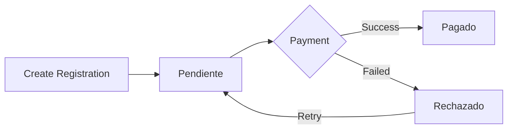

## Overview

The **Inscripcion** content type manages event registration submissions with integrated payment processing through Flow. It tracks participant information, payment status, and transaction details.

<Note>
  This is a **collection type** with **draft and publish disabled**. Registrations are created immediately and processed in real-time.
</Note>

## Schema Information

- **Collection Name**: `inscripcions`
- **Singular**: `inscripcion`
- **Plural**: `inscripcions`
- **Draft & Publish**: Disabled (immediate processing)

## Attributes

### nombreCompleto

<ParamField path="nombreCompleto" type="string">
  Full name of the person registering.
  
  - Optional field
  - Free text format
</ParamField>

### rut

<ParamField path="rut" type="string">
  Chilean national identification number (RUT).
  
  - Optional field
  - Format: XX.XXX.XXX-X
  - Should include verification digit
</ParamField>

### edad

<ParamField path="edad" type="integer">
  Age of the participant.
  
  - Optional field
  - Numeric value
  - Used for category assignment
</ParamField>

### categoria

<ParamField path="categoria" type="string">
  Race category for the participant.
  
  - Optional field
  - Free text format
  - Examples: "Infantil", "Experto", "Elite", "Master A"
</ParamField>

### tipo

<ParamField path="tipo" type="string">
  Registration type.
  
  - Optional field
  - Free text format
  - Examples: "Open", "Federado"
</ParamField>

### email

<ParamField path="email" type="email">
  Contact email address.
  
  - Email format validation
  - Optional field
  - Used for confirmation and communication
</ParamField>

### monto

<ParamField path="monto" type="integer">
  Payment amount in Chilean pesos.
  
  - Optional field
  - Integer value (no decimals)
  - Example: 15000 for $15,000 CLP
</ParamField>

### tokenFlow

<ParamField path="tokenFlow" type="string">
  Flow payment gateway token.
  
  - Optional field
  - Generated by Flow during payment initialization
  - Used to track payment session
</ParamField>

### estadoPago

<ParamField path="estadoPago" type="enumeration" default="Pendiente">
  Current payment status.
  
  - **Default**: "Pendiente"
  - **Allowed values**:
    - `Pendiente`: Payment not yet completed
    - `Pagado`: Payment successful
    - `Rechazado`: Payment failed or rejected
  - Updated by payment webhook
</ParamField>

### ordenFlow

<ParamField path="ordenFlow" type="string">
  Flow order number.
  
  - Optional field
  - Assigned by Flow after payment confirmation
  - Used for payment reconciliation
</ParamField>

### telefono

<ParamField path="telefono" type="string">
  Contact phone number.
  
  - Optional field
  - Free text format
  - Example: "+56912345678"
</ParamField>

## API Endpoints

### List All Registrations

<CodeGroup>
```bash cURL
curl -X GET 'https://api.example.com/api/inscripcions' \
  -H 'Authorization: Bearer YOUR_TOKEN'
```

```javascript JavaScript
const response = await fetch('https://api.example.com/api/inscripcions', {
  headers: {
    'Authorization': 'Bearer YOUR_TOKEN'
  }
});
const data = await response.json();
```
</CodeGroup>

<ResponseField name="data" type="array">
  Array of registration entries
  
  <Expandable title="properties">
    <ResponseField name="id" type="number">
      Unique identifier
    </ResponseField>
    
    <ResponseField name="attributes" type="object">
      Registration attributes and data
      
      <Expandable title="properties">
        <ResponseField name="nombreCompleto" type="string">
          Participant full name
        </ResponseField>
        
        <ResponseField name="rut" type="string">
          Chilean RUT
        </ResponseField>
        
        <ResponseField name="edad" type="integer">
          Participant age
        </ResponseField>
        
        <ResponseField name="categoria" type="string">
          Race category
        </ResponseField>
        
        <ResponseField name="tipo" type="string">
          Registration type
        </ResponseField>
        
        <ResponseField name="email" type="string">
          Contact email
        </ResponseField>
        
        <ResponseField name="telefono" type="string">
          Contact phone
        </ResponseField>
        
        <ResponseField name="monto" type="integer">
          Payment amount (CLP)
        </ResponseField>
        
        <ResponseField name="tokenFlow" type="string">
          Flow payment token
        </ResponseField>
        
        <ResponseField name="estadoPago" type="string">
          Payment status (Pendiente, Pagado, Rechazado)
        </ResponseField>
        
        <ResponseField name="ordenFlow" type="string">
          Flow order number
        </ResponseField>
        
        <ResponseField name="createdAt" type="datetime">
          Creation timestamp
        </ResponseField>
        
        <ResponseField name="updatedAt" type="datetime">
          Last update timestamp
        </ResponseField>
      </Expandable>
    </ResponseField>
  </Expandable>
</ResponseField>

### Get Single Registration

<CodeGroup>
```bash cURL
curl -X GET 'https://api.example.com/api/inscripcions/1' \
  -H 'Authorization: Bearer YOUR_TOKEN'
```

```javascript JavaScript
const response = await fetch('https://api.example.com/api/inscripcions/1', {
  headers: {
    'Authorization': 'Bearer YOUR_TOKEN'
  }
});
const data = await response.json();
```
</CodeGroup>

### Create Registration

<CodeGroup>
```bash cURL
curl -X POST 'https://api.example.com/api/inscripcions' \
  -H 'Authorization: Bearer YOUR_TOKEN' \
  -H 'Content-Type: application/json' \
  -d '{
    "data": {
      "nombreCompleto": "María González",
      "rut": "12.345.678-9",
      "edad": 28,
      "categoria": "Experto",
      "tipo": "Open",
      "email": "maria.gonzalez@example.com",
      "telefono": "+56912345678",
      "monto": 15000,
      "estadoPago": "Pendiente"
    }
  }'
```

```javascript JavaScript
const response = await fetch('https://api.example.com/api/inscripcions', {
  method: 'POST',
  headers: {
    'Authorization': 'Bearer YOUR_TOKEN',
    'Content-Type': 'application/json'
  },
  body: JSON.stringify({
    data: {
      nombreCompleto: 'María González',
      rut: '12.345.678-9',
      edad: 28,
      categoria: 'Experto',
      tipo: 'Open',
      email: 'maria.gonzalez@example.com',
      telefono: '+56912345678',
      monto: 15000,
      estadoPago: 'Pendiente'
    }
  })
});
const data = await response.json();
```
</CodeGroup>

### Update Registration Status

<CodeGroup>
```bash cURL
curl -X PUT 'https://api.example.com/api/inscripcions/1' \
  -H 'Authorization: Bearer YOUR_TOKEN' \
  -H 'Content-Type: application/json' \
  -d '{
    "data": {
      "estadoPago": "Pagado",
      "ordenFlow": "ORD-123456"
    }
  }'
```

```javascript JavaScript
const response = await fetch('https://api.example.com/api/inscripcions/1', {
  method: 'PUT',
  headers: {
    'Authorization': 'Bearer YOUR_TOKEN',
    'Content-Type': 'application/json'
  },
  body: JSON.stringify({
    data: {
      estadoPago: 'Pagado',
      ordenFlow: 'ORD-123456'
    }
  })
});
const data = await response.json();
```
</CodeGroup>

### Delete Registration

<CodeGroup>
```bash cURL
curl -X DELETE 'https://api.example.com/api/inscripcions/1' \
  -H 'Authorization: Bearer YOUR_TOKEN'
```

```javascript JavaScript
const response = await fetch('https://api.example.com/api/inscripcions/1', {
  method: 'DELETE',
  headers: {
    'Authorization': 'Bearer YOUR_TOKEN'
  }
});
const data = await response.json();
```
</CodeGroup>

## Query Parameters

### Filter by Payment Status

```bash
# Paid registrations only
curl -X GET 'https://api.example.com/api/inscripcions?filters[estadoPago][$eq]=Pagado' \
  -H 'Authorization: Bearer YOUR_TOKEN'

# Pending payments
curl -X GET 'https://api.example.com/api/inscripcions?filters[estadoPago][$eq]=Pendiente' \
  -H 'Authorization: Bearer YOUR_TOKEN'
```

### Filter by Category

```bash
curl -X GET 'https://api.example.com/api/inscripcions?filters[categoria][$eq]=Experto' \
  -H 'Authorization: Bearer YOUR_TOKEN'
```

### Filter by Type

```bash
curl -X GET 'https://api.example.com/api/inscripcions?filters[tipo][$eq]=Federado' \
  -H 'Authorization: Bearer YOUR_TOKEN'
```

### Sorting

```bash
# Sort by creation date (newest first)
curl -X GET 'https://api.example.com/api/inscripcions?sort=createdAt:desc' \
  -H 'Authorization: Bearer YOUR_TOKEN'
```

## Flow Payment Integration

### Registration Flow

1. **Create Registration**: Create an inscripcion record with `estadoPago: "Pendiente"`
2. **Initialize Payment**: Call Flow API to get `tokenFlow`
3. **Update Registration**: Store `tokenFlow` in the registration
4. **Redirect User**: Send user to Flow payment page
5. **Webhook Callback**: Flow sends payment result to your webhook
6. **Update Status**: Update `estadoPago` to "Pagado" or "Rechazado"
7. **Store Order**: Save `ordenFlow` for reconciliation

<Note>
  Always validate Flow webhook signatures to prevent fraudulent payment confirmations.
</Note>

## Example Response

```json
{
  "data": {
    "id": 1,
    "attributes": {
      "nombreCompleto": "María González",
      "rut": "12.345.678-9",
      "edad": 28,
      "categoria": "Experto",
      "tipo": "Open",
      "email": "maria.gonzalez@example.com",
      "telefono": "+56912345678",
      "monto": 15000,
      "tokenFlow": "FLW-TKN-ABC123XYZ",
      "estadoPago": "Pagado",
      "ordenFlow": "ORD-123456",
      "createdAt": "2026-03-04T10:30:00.000Z",
      "updatedAt": "2026-03-04T10:35:00.000Z"
    }
  },
  "meta": {}
}
```

## Payment Status Workflow



## Best Practices

<CardGroup cols={2}>
  <Card title="Validate RUT" icon="id-card">
    Validate Chilean RUT format and verification digit on the client side before submission to prevent errors.
  </Card>
  
  <Card title="Email Confirmations" icon="envelope">
    Send confirmation emails immediately after registration creation and after successful payment.
  </Card>
  
  <Card title="Payment Timeout" icon="clock">
    Set a timeout for pending payments (e.g., 30 minutes). Mark as "Rechazado" if not completed.
  </Card>
  
  <Card title="Secure Webhooks" icon="shield">
    Always verify Flow webhook signatures and use HTTPS endpoints for payment callbacks.
  </Card>
  
  <Card title="Audit Trail" icon="list-check">
    Log all payment status changes with timestamps for troubleshooting and reconciliation.
  </Card>
  
  <Card title="Error Handling" icon="triangle-exclamation">
    Implement proper error handling for failed payments and provide clear user feedback.
  </Card>
</CardGroup>

## Payment Reconciliation

Use `ordenFlow` to reconcile payments with Flow transaction records:

```bash
# Get all paid registrations for reconciliation
curl -X GET 'https://api.example.com/api/inscripcions?filters[estadoPago][$eq]=Pagado&fields[0]=ordenFlow&fields[1]=monto&fields[2]=email' \
  -H 'Authorization: Bearer YOUR_TOKEN'
```

<Note>
  Store both `tokenFlow` (session) and `ordenFlow` (confirmation) for complete payment tracking.
</Note>
