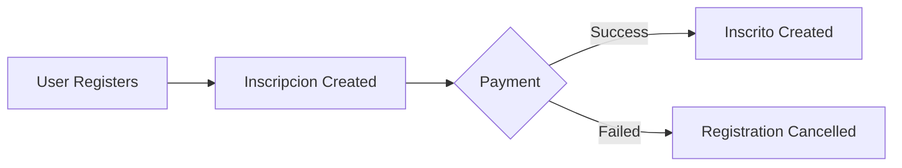

## Overview

The **Inscrito** content type manages confirmed participant records for races and events. Unlike Inscripcion (which tracks payment processing), Inscrito represents final, confirmed participants with validated information.

<Note>
  This is a **collection type** with **draft and publish** enabled. Participants can be reviewed before being made public.
</Note>

## Schema Information

- **Collection Name**: `inscritos`
- **Singular**: `inscrito`
- **Plural**: `inscritos`
- **Draft & Publish**: Enabled

## Attributes

### nombreCompleto

<ParamField path="nombreCompleto" type="string" required>
  Full name of the confirmed participant.
  
  - **Required field**
  - Free text format
  - Must be provided for all participants
</ParamField>

### rut

<ParamField path="rut" type="string" required>
  Chilean national identification number (RUT).
  
  - **Required field**
  - Format: XX.XXX.XXX-X
  - Must include verification digit
  - Used as unique identifier for participants
</ParamField>

### edad

<ParamField path="edad" type="integer" required>
  Age of the participant.
  
  - **Required field**
  - **Minimum**: 3
  - **Maximum**: 99
  - Used for category eligibility validation
</ParamField>

### categoria

<ParamField path="categoria" type="enumeration" required>
  Race category classification.
  
  - **Required field**
  - **Allowed values**:
    - `Infantil`: Youth category
    - `Experto`: Expert riders
    - `Enduro`: Enduro category
    - `Elite`: Elite/professional level
    - `Master A`: Master A age group
    - `Master B`: Master B age group
  - Must be one of the predefined values
</ParamField>

### tipo

<ParamField path="tipo" type="enumeration" required>
  Registration type classification.
  
  - **Required field**
  - **Allowed values**:
    - `Open`: Open category participants
    - `Federado`: Federated/licensed riders
  - Determines race rules and eligibility
</ParamField>

## API Endpoints

### List All Participants

<CodeGroup>
```bash cURL
curl -X GET 'https://api.example.com/api/inscritos?publicationState=live' \
  -H 'Authorization: Bearer YOUR_TOKEN'
```

```javascript JavaScript
const response = await fetch('https://api.example.com/api/inscritos?publicationState=live', {
  headers: {
    'Authorization': 'Bearer YOUR_TOKEN'
  }
});
const data = await response.json();
```
</CodeGroup>

<ResponseField name="data" type="array">
  Array of participant entries
  
  <Expandable title="properties">
    <ResponseField name="id" type="number">
      Unique identifier
    </ResponseField>
    
    <ResponseField name="attributes" type="object">
      Participant attributes and data
      
      <Expandable title="properties">
        <ResponseField name="nombreCompleto" type="string" required>
          Participant full name
        </ResponseField>
        
        <ResponseField name="rut" type="string" required>
          Chilean RUT
        </ResponseField>
        
        <ResponseField name="edad" type="integer" required>
          Participant age (3-99)
        </ResponseField>
        
        <ResponseField name="categoria" type="string" required>
          Race category (Infantil, Experto, Enduro, Elite, Master A, Master B)
        </ResponseField>
        
        <ResponseField name="tipo" type="string" required>
          Registration type (Open, Federado)
        </ResponseField>
        
        <ResponseField name="createdAt" type="datetime">
          Creation timestamp
        </ResponseField>
        
        <ResponseField name="updatedAt" type="datetime">
          Last update timestamp
        </ResponseField>
        
        <ResponseField name="publishedAt" type="datetime">
          Publication timestamp (null if draft)
        </ResponseField>
      </Expandable>
    </ResponseField>
  </Expandable>
</ResponseField>

### Get Single Participant

<CodeGroup>
```bash cURL
curl -X GET 'https://api.example.com/api/inscritos/1' \
  -H 'Authorization: Bearer YOUR_TOKEN'
```

```javascript JavaScript
const response = await fetch('https://api.example.com/api/inscritos/1', {
  headers: {
    'Authorization': 'Bearer YOUR_TOKEN'
  }
});
const data = await response.json();
```
</CodeGroup>

### Create Participant

<CodeGroup>
```bash cURL
curl -X POST 'https://api.example.com/api/inscritos' \
  -H 'Authorization: Bearer YOUR_TOKEN' \
  -H 'Content-Type: application/json' \
  -d '{
    "data": {
      "nombreCompleto": "Carlos Rodríguez",
      "rut": "18.765.432-1",
      "edad": 32,
      "categoria": "Elite",
      "tipo": "Federado"
    }
  }'
```

```javascript JavaScript
const response = await fetch('https://api.example.com/api/inscritos', {
  method: 'POST',
  headers: {
    'Authorization': 'Bearer YOUR_TOKEN',
    'Content-Type': 'application/json'
  },
  body: JSON.stringify({
    data: {
      nombreCompleto: 'Carlos Rodríguez',
      rut: '18.765.432-1',
      edad: 32,
      categoria: 'Elite',
      tipo: 'Federado'
    }
  })
});
const data = await response.json();
```
</CodeGroup>

### Update Participant

<CodeGroup>
```bash cURL
curl -X PUT 'https://api.example.com/api/inscritos/1' \
  -H 'Authorization: Bearer YOUR_TOKEN' \
  -H 'Content-Type: application/json' \
  -d '{
    "data": {
      "categoria": "Master A"
    }
  }'
```

```javascript JavaScript
const response = await fetch('https://api.example.com/api/inscritos/1', {
  method: 'PUT',
  headers: {
    'Authorization': 'Bearer YOUR_TOKEN',
    'Content-Type': 'application/json'
  },
  body: JSON.stringify({
    data: {
      categoria: 'Master A'
    }
  })
});
const data = await response.json();
```
</CodeGroup>

### Delete Participant

<CodeGroup>
```bash cURL
curl -X DELETE 'https://api.example.com/api/inscritos/1' \
  -H 'Authorization: Bearer YOUR_TOKEN'
```

```javascript JavaScript
const response = await fetch('https://api.example.com/api/inscritos/1', {
  method: 'DELETE',
  headers: {
    'Authorization': 'Bearer YOUR_TOKEN'
  }
});
const data = await response.json();
```
</CodeGroup>

## Query Parameters

### Filter by Category

```bash
# Elite participants
curl -X GET 'https://api.example.com/api/inscritos?filters[categoria][$eq]=Elite' \
  -H 'Authorization: Bearer YOUR_TOKEN'

# Multiple categories
curl -X GET 'https://api.example.com/api/inscritos?filters[categoria][$in][0]=Elite&filters[categoria][$in][1]=Experto' \
  -H 'Authorization: Bearer YOUR_TOKEN'
```

### Filter by Type

```bash
# Federated riders only
curl -X GET 'https://api.example.com/api/inscritos?filters[tipo][$eq]=Federado' \
  -H 'Authorization: Bearer YOUR_TOKEN'
```

### Filter by Age Range

```bash
# Participants aged 25-35
curl -X GET 'https://api.example.com/api/inscritos?filters[edad][$gte]=25&filters[edad][$lte]=35' \
  -H 'Authorization: Bearer YOUR_TOKEN'
```

### Sorting

```bash
# Sort by name alphabetically
curl -X GET 'https://api.example.com/api/inscritos?sort=nombreCompleto:asc' \
  -H 'Authorization: Bearer YOUR_TOKEN'

# Sort by age (youngest first)
curl -X GET 'https://api.example.com/api/inscritos?sort=edad:asc' \
  -H 'Authorization: Bearer YOUR_TOKEN'
```

### Pagination

```bash
curl -X GET 'https://api.example.com/api/inscritos?pagination[page]=1&pagination[pageSize]=50' \
  -H 'Authorization: Bearer YOUR_TOKEN'
```

### Publication State

```bash
# Published only (default)
curl -X GET 'https://api.example.com/api/inscritos?publicationState=live' \
  -H 'Authorization: Bearer YOUR_TOKEN'

# Include drafts
curl -X GET 'https://api.example.com/api/inscritos?publicationState=preview' \
  -H 'Authorization: Bearer YOUR_TOKEN'
```

## Example Response

```json
{
  "data": [
    {
      "id": 1,
      "attributes": {
        "nombreCompleto": "Carlos Rodríguez",
        "rut": "18.765.432-1",
        "edad": 32,
        "categoria": "Elite",
        "tipo": "Federado",
        "createdAt": "2026-03-04T08:00:00.000Z",
        "updatedAt": "2026-03-04T08:00:00.000Z",
        "publishedAt": "2026-03-04T08:05:00.000Z"
      }
    },
    {
      "id": 2,
      "attributes": {
        "nombreCompleto": "Ana Martínez",
        "rut": "16.543.210-9",
        "edad": 28,
        "categoria": "Experto",
        "tipo": "Open",
        "createdAt": "2026-03-04T09:15:00.000Z",
        "updatedAt": "2026-03-04T09:15:00.000Z",
        "publishedAt": "2026-03-04T09:20:00.000Z"
      }
    }
  ],
  "meta": {
    "pagination": {
      "page": 1,
      "pageSize": 25,
      "pageCount": 1,
      "total": 2
    }
  }
}
```

## Categories Explained

<CardGroup cols={2}>
  <Card title="Infantil" icon="child">
    Youth category for younger participants. Typically ages 3-15.
  </Card>
  
  <Card title="Experto" icon="trophy">
    Expert riders with advanced skills. Intermediate to advanced level.
  </Card>
  
  <Card title="Enduro" icon="mountain">
    Enduro-specific category for technical downhill and climbing sections.
  </Card>
  
  <Card title="Elite" icon="star">
    Elite/professional level riders. Highest competitive category.
  </Card>
  
  <Card title="Master A" icon="medal">
    Master A age group, typically 30-39 years old.
  </Card>
  
  <Card title="Master B" icon="medal">
    Master B age group, typically 40+ years old.
  </Card>
</CardGroup>

## Registration Types

### Open
Open category participants who are not affiliated with a federation. Generally:
- No license required
- Open to recreational riders
- May have different rules or start times

### Federado
Federated/licensed riders who are:
- Registered with a cycling federation
- Hold a valid racing license
- Compete under federation rules
- May be eligible for ranking points

## Validation Rules

<Note>
  All fields are required. The system enforces the following validations:
</Note>

- **nombreCompleto**: Must not be empty
- **rut**: Must not be empty, validate format on client
- **edad**: Must be between 3 and 99 (inclusive)
- **categoria**: Must be one of: Infantil, Experto, Enduro, Elite, Master A, Master B
- **tipo**: Must be either Open or Federado

## Relationship with Inscripcion

While **Inscripcion** handles the payment and registration process, **Inscrito** represents confirmed participants:



<Note>
  Typically, an Inscrito record is created only after successful payment confirmation in the Inscripcion flow.
</Note>

## Best Practices

<CardGroup cols={2}>
  <Card title="Validate RUT" icon="check-circle">
    Always validate RUT format and verification digit before creating participant records to maintain data integrity.
  </Card>
  
  <Card title="Age Verification" icon="id-card">
    Validate that participant age falls within the allowed range (3-99) and matches their selected category.
  </Card>
  
  <Card title="Category Rules" icon="book">
    Implement category eligibility rules based on age and rider type to ensure proper classification.
  </Card>
  
  <Card title="Draft Review" icon="magnifying-glass">
    Use draft mode to review participant information before publishing to participant lists.
  </Card>
  
  <Card title="Duplicate Prevention" icon="shield">
    Check for duplicate RUT values before creating new participants to prevent double registrations.
  </Card>
  
  <Card title="Bulk Operations" icon="list">
    Use pagination and filtering for efficient bulk operations when managing large participant lists.
  </Card>
</CardGroup>

## Participant Lists

Generate participant lists by category:

<CodeGroup>
```bash Elite List
curl -X GET 'https://api.example.com/api/inscritos?filters[categoria][$eq]=Elite&sort=nombreCompleto:asc&publicationState=live' \
  -H 'Authorization: Bearer YOUR_TOKEN'
```

```bash Federado List
curl -X GET 'https://api.example.com/api/inscritos?filters[tipo][$eq]=Federado&sort=categoria:asc,nombreCompleto:asc&publicationState=live' \
  -H 'Authorization: Bearer YOUR_TOKEN'
```

```bash Age Group List
curl -X GET 'https://api.example.com/api/inscritos?filters[edad][$gte]=30&filters[edad][$lt]=40&sort=nombreCompleto:asc&publicationState=live' \
  -H 'Authorization: Bearer YOUR_TOKEN'
```
</CodeGroup>

## Statistics Query

Get participant counts by category:

```bash
# Total participants
curl -X GET 'https://api.example.com/api/inscritos?pagination[pageSize]=1&publicationState=live' \
  -H 'Authorization: Bearer YOUR_TOKEN'

# The meta.pagination.total field contains the total count
```
