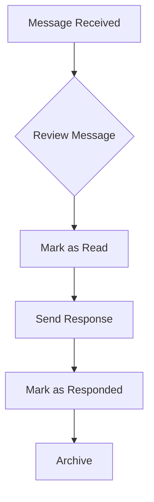

## Overview

The **Mensaje** content type manages contact form submissions and communications from website visitors. It tracks messages, sender information, and response status.

<Note>
  This is a **collection type** with **draft and publish** enabled. Messages can be reviewed before being marked as handled.
</Note>

## Schema Information

- **Collection Name**: `mensajes`
- **Singular**: `mensaje`
- **Plural**: `mensajes`
- **Draft & Publish**: Enabled

## Attributes

### nombre

<ParamField path="nombre" type="string" required>
  Name of the person sending the message.
  
  - **Required field**
  - Free text format
  - Used for addressing responses
</ParamField>

### email

<ParamField path="email" type="email" required>
  Email address of the sender.
  
  - **Required field**
  - Email format validation
  - Used for sending responses
</ParamField>

### mensaje

<ParamField path="mensaje" type="blocks" required>
  The message content.
  
  - **Required field**
  - Supports rich text blocks
  - Can include formatting, links, and structured content
  - Main communication from the sender
</ParamField>

### fecha

<ParamField path="fecha" type="datetime">
  Timestamp when the message was sent.
  
  - Optional field
  - Datetime format: ISO 8601
  - Automatically set to submission time if not provided
</ParamField>

### respondido

<ParamField path="respondido" type="boolean" default={false}>
  Whether the message has been responded to.
  
  - **Default**: `false`
  - Used to track message handling status
  - Set to `true` after sending a response
</ParamField>

## API Endpoints

### List All Messages

<CodeGroup>
```bash cURL
curl -X GET 'https://api.example.com/api/mensajes?sort=fecha:desc' \
  -H 'Authorization: Bearer YOUR_TOKEN'
```

```javascript JavaScript
const response = await fetch('https://api.example.com/api/mensajes?sort=fecha:desc', {
  headers: {
    'Authorization': 'Bearer YOUR_TOKEN'
  }
});
const data = await response.json();
```
</CodeGroup>

<ResponseField name="data" type="array">
  Array of message entries
  
  <Expandable title="properties">
    <ResponseField name="id" type="number">
      Unique identifier
    </ResponseField>
    
    <ResponseField name="attributes" type="object">
      Message attributes and data
      
      <Expandable title="properties">
        <ResponseField name="nombre" type="string" required>
          Sender name
        </ResponseField>
        
        <ResponseField name="email" type="string" required>
          Sender email address
        </ResponseField>
        
        <ResponseField name="mensaje" type="array" required>
          Rich text blocks for message content
        </ResponseField>
        
        <ResponseField name="fecha" type="datetime">
          Message submission timestamp
        </ResponseField>
        
        <ResponseField name="respondido" type="boolean">
          Response status
        </ResponseField>
        
        <ResponseField name="createdAt" type="datetime">
          Creation timestamp
        </ResponseField>
        
        <ResponseField name="updatedAt" type="datetime">
          Last update timestamp
        </ResponseField>
        
        <ResponseField name="publishedAt" type="datetime">
          Publication timestamp (null if draft)
        </ResponseField>
      </Expandable>
    </ResponseField>
  </Expandable>
</ResponseField>

### Get Single Message

<CodeGroup>
```bash cURL
curl -X GET 'https://api.example.com/api/mensajes/1' \
  -H 'Authorization: Bearer YOUR_TOKEN'
```

```javascript JavaScript
const response = await fetch('https://api.example.com/api/mensajes/1', {
  headers: {
    'Authorization': 'Bearer YOUR_TOKEN'
  }
});
const data = await response.json();
```
</CodeGroup>

### Create Message

<CodeGroup>
```bash cURL
curl -X POST 'https://api.example.com/api/mensajes' \
  -H 'Authorization: Bearer YOUR_TOKEN' \
  -H 'Content-Type: application/json' \
  -d '{
    "data": {
      "nombre": "Pedro Silva",
      "email": "pedro.silva@example.com",
      "mensaje": [
        {
          "type": "paragraph",
          "children": [
            {
              "type": "text",
              "text": "Hola, me gustaría obtener más información sobre las próximas competencias."
            }
          ]
        }
      ],
      "fecha": "2026-03-04T14:30:00.000Z",
      "respondido": false
    }
  }'
```

```javascript JavaScript
const response = await fetch('https://api.example.com/api/mensajes', {
  method: 'POST',
  headers: {
    'Authorization': 'Bearer YOUR_TOKEN',
    'Content-Type': 'application/json'
  },
  body: JSON.stringify({
    data: {
      nombre: 'Pedro Silva',
      email: 'pedro.silva@example.com',
      mensaje: [
        {
          type: 'paragraph',
          children: [
            {
              type: 'text',
              text: 'Hola, me gustaría obtener más información sobre las próximas competencias.'
            }
          ]
        }
      ],
      fecha: new Date().toISOString(),
      respondido: false
    }
  })
});
const data = await response.json();
```
</CodeGroup>

### Mark as Responded

<CodeGroup>
```bash cURL
curl -X PUT 'https://api.example.com/api/mensajes/1' \
  -H 'Authorization: Bearer YOUR_TOKEN' \
  -H 'Content-Type: application/json' \
  -d '{
    "data": {
      "respondido": true
    }
  }'
```

```javascript JavaScript
const response = await fetch('https://api.example.com/api/mensajes/1', {
  method: 'PUT',
  headers: {
    'Authorization': 'Bearer YOUR_TOKEN',
    'Content-Type': 'application/json'
  },
  body: JSON.stringify({
    data: {
      respondido: true
    }
  })
});
const data = await response.json();
```
</CodeGroup>

### Delete Message

<CodeGroup>
```bash cURL
curl -X DELETE 'https://api.example.com/api/mensajes/1' \
  -H 'Authorization: Bearer YOUR_TOKEN'
```

```javascript JavaScript
const response = await fetch('https://api.example.com/api/mensajes/1', {
  method: 'DELETE',
  headers: {
    'Authorization': 'Bearer YOUR_TOKEN'
  }
});
const data = await response.json();
```
</CodeGroup>

## Query Parameters

### Filter Unresponded Messages

```bash
curl -X GET 'https://api.example.com/api/mensajes?filters[respondido][$eq]=false&sort=fecha:asc' \
  -H 'Authorization: Bearer YOUR_TOKEN'
```

### Filter Responded Messages

```bash
curl -X GET 'https://api.example.com/api/mensajes?filters[respondido][$eq]=true' \
  -H 'Authorization: Bearer YOUR_TOKEN'
```

### Filter by Date Range

```bash
# Messages from last 7 days
curl -X GET 'https://api.example.com/api/mensajes?filters[fecha][$gte]=2026-02-26T00:00:00Z&sort=fecha:desc' \
  -H 'Authorization: Bearer YOUR_TOKEN'
```

### Search by Sender Email

```bash
curl -X GET 'https://api.example.com/api/mensajes?filters[email][$contains]=example.com' \
  -H 'Authorization: Bearer YOUR_TOKEN'
```

### Sorting

```bash
# Newest first
curl -X GET 'https://api.example.com/api/mensajes?sort=fecha:desc' \
  -H 'Authorization: Bearer YOUR_TOKEN'

# Oldest unresponded first (priority queue)
curl -X GET 'https://api.example.com/api/mensajes?filters[respondido][$eq]=false&sort=fecha:asc' \
  -H 'Authorization: Bearer YOUR_TOKEN'
```

## Example Response

```json
{
  "data": [
    {
      "id": 1,
      "attributes": {
        "nombre": "Pedro Silva",
        "email": "pedro.silva@example.com",
        "mensaje": [
          {
            "type": "paragraph",
            "children": [
              {
                "type": "text",
                "text": "Hola, me gustaría obtener más información sobre las próximas competencias."
              }
            ]
          },
          {
            "type": "paragraph",
            "children": [
              {
                "type": "text",
                "text": "Específicamente sobre fechas y categorías disponibles."
              }
            ]
          }
        ],
        "fecha": "2026-03-04T14:30:00.000Z",
        "respondido": false,
        "createdAt": "2026-03-04T14:30:05.000Z",
        "updatedAt": "2026-03-04T14:30:05.000Z",
        "publishedAt": "2026-03-04T14:30:10.000Z"
      }
    }
  ],
  "meta": {
    "pagination": {
      "page": 1,
      "pageSize": 25,
      "pageCount": 1,
      "total": 1
    }
  }
}
```

## Contact Form Integration

### Frontend Implementation

<CodeGroup>
```javascript React Example
import { useState } from 'react';

function ContactForm() {
  const [formData, setFormData] = useState({
    nombre: '',
    email: '',
    mensaje: ''
  });
  const [status, setStatus] = useState('idle');

  const handleSubmit = async (e) => {
    e.preventDefault();
    setStatus('submitting');

    try {
      const response = await fetch('https://api.example.com/api/mensajes', {
        method: 'POST',
        headers: {
          'Authorization': 'Bearer YOUR_TOKEN',
          'Content-Type': 'application/json'
        },
        body: JSON.stringify({
          data: {
            nombre: formData.nombre,
            email: formData.email,
            mensaje: [
              {
                type: 'paragraph',
                children: [
                  {
                    type: 'text',
                    text: formData.mensaje
                  }
                ]
              }
            ],
            fecha: new Date().toISOString(),
            respondido: false
          }
        })
      });

      if (response.ok) {
        setStatus('success');
        setFormData({ nombre: '', email: '', mensaje: '' });
      } else {
        setStatus('error');
      }
    } catch (error) {
      setStatus('error');
    }
  };

  return (
    <form onSubmit={handleSubmit}>
      <input
        type="text"
        placeholder="Nombre"
        value={formData.nombre}
        onChange={(e) => setFormData({ ...formData, nombre: e.target.value })}
        required
      />
      <input
        type="email"
        placeholder="Email"
        value={formData.email}
        onChange={(e) => setFormData({ ...formData, email: e.target.value })}
        required
      />
      <textarea
        placeholder="Mensaje"
        value={formData.mensaje}
        onChange={(e) => setFormData({ ...formData, mensaje: e.target.value })}
        required
      />
      <button type="submit" disabled={status === 'submitting'}>
        {status === 'submitting' ? 'Enviando...' : 'Enviar'}
      </button>
      {status === 'success' && <p>Mensaje enviado con éxito!</p>}
      {status === 'error' && <p>Error al enviar. Intente nuevamente.</p>}
    </form>
  );
}
```
</CodeGroup>

## Message Management Workflow



## Best Practices

<CardGroup cols={2}>
  <Card title="Auto-Timestamp" icon="clock">
    Automatically set the fecha field to the current timestamp when creating messages from contact forms.
  </Card>
  
  <Card title="Email Validation" icon="envelope">
    Validate email format on both client and server side to ensure deliverability of responses.
  </Card>
  
  <Card title="Response SLA" icon="timer">
    Monitor unresponded messages and establish a service level agreement for response times (e.g., 24-48 hours).
  </Card>
  
  <Card title="Spam Prevention" icon="shield">
    Implement CAPTCHA or rate limiting on the contact form to prevent spam submissions.
  </Card>
  
  <Card title="Notification System" icon="bell">
    Set up email notifications to admins when new messages are received for prompt responses.
  </Card>
  
  <Card title="Message Archive" icon="box-archive">
    Periodically archive old responded messages to keep the active message list manageable.
  </Card>
</CardGroup>

## Notifications and Alerts

### Get Pending Message Count

```bash
curl -X GET 'https://api.example.com/api/mensajes?filters[respondido][$eq]=false&pagination[pageSize]=1' \
  -H 'Authorization: Bearer YOUR_TOKEN'

# Check meta.pagination.total for the count
```

### Priority Messages (Older than 48 hours)

```bash
curl -X GET 'https://api.example.com/api/mensajes?filters[respondido][$eq]=false&filters[fecha][$lt]=2026-03-02T14:00:00Z&sort=fecha:asc' \
  -H 'Authorization: Bearer YOUR_TOKEN'
```

## Email Response Template

When responding to messages, include:

1. **Greeting**: Use the sender's name from the `nombre` field
2. **Acknowledgment**: Reference their original message
3. **Response**: Provide the requested information or assistance
4. **Call to Action**: Next steps or additional resources
5. **Signature**: Club contact information

<Note>
  After sending a response email, always update the message record to set `respondido: true` for accurate tracking.
</Note>

## Message Statistics

### Response Rate

Calculate your team's response rate:

```bash
# Total messages
curl -X GET 'https://api.example.com/api/mensajes?pagination[pageSize]=1' \
  -H 'Authorization: Bearer YOUR_TOKEN'

# Responded messages
curl -X GET 'https://api.example.com/api/mensajes?filters[respondido][$eq]=true&pagination[pageSize]=1' \
  -H 'Authorization: Bearer YOUR_TOKEN'

# Response Rate = (Responded / Total) * 100
```

## Rich Text Message Content

The `mensaje` field supports rich text blocks. Example structure:

```json
[
  {
    "type": "paragraph",
    "children": [
      {
        "type": "text",
        "text": "Hola, tengo una consulta sobre "
      },
      {
        "type": "text",
        "text": "las inscripciones",
        "bold": true
      },
      {
        "type": "text",
        "text": "."
      }
    ]
  },
  {
    "type": "paragraph",
    "children": [
      {
        "type": "text",
        "text": "¿Cuándo cierran?"
      }
    ]
  }
]
```

<Note>
  While rich text is supported, most contact forms will submit plain text. The blocks structure ensures consistency with other content types.
</Note>
